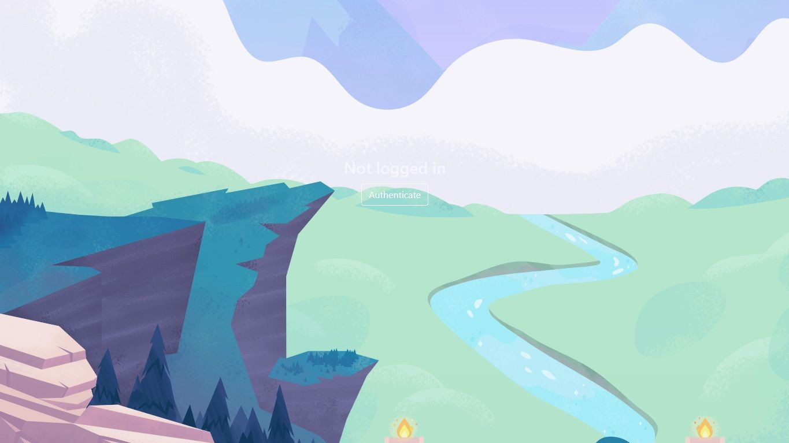

<div></div>

# Discord Friends


<br>

## Description

___
Backup discord friends incase of account loss

## Requirements

___

1. `Python` >=3.5 or `Anaconda`
2. A discord account with (`developer options`)
3. PostgreSQL installed with database set up already (optional - for best peformance)
4. [`mkcert`](https://github.com/FiloSottile/mkcert) toolkit (for creating certificates for `https`)

<br>

## Installation / Usage

___

## Anaconda

1. Clone this repository with command `git clone https://github.com/LokotamaTheMastermind/discord-friends.git`
2. Enter the folder with anaconda enabled and in `base` virtual environment
3. Change the directory to `scripts/{op}`, where `{op}` is your operating system. Then after run the file starting with the prefix only `install`
4. Wait for project server to startup
5. Then open browser in url `https://localhost:100`

## PIP

1. Clone this repository with command `git clone https://github.com/LokotamaTheMastermind/discord-friends.git`
2. Activate your virtualenv if you have any
3. Change directory to `scripts/{op}` where `{op}` is your operating system. Then run the file starting with the prefix only `install_pip` in cmd
4. Wait for the project server to startup
5. Then open browser in url `https://localhost:100`

<br>

**Important Notice** - I suggest you read further for information about configuring the project

<br>

## Configuration

### Database

___

### Default database

```python
DATABASES = {
    'default': {
        'ENGINE': 'django.db.backends.sqlite3',
        'NAME': BASE_DIR / 'db.sqlite3',
    }
}
```

### Configure database (postgresql)

Use only if you have postgresql installed and know how to use it

```python
DATABASES = {
    'default': {
        'ENGINE': 'django.db.backends.postgresql',
        'NAME': 'database_name',
        'USER': 'database_user',
        'PASSWORD': 'database_password',
        'HOST': 'database_host',
        'PORT': 'database_port',
    }
}
```

<br>

## Screenshots

___




<br>

## Questions

___

> 1. How do you find the `User ID` of a discord user

>> Answer - Enable the `developer` options of discord account. After that right-click on users account and look for the option `Copy User ID`

<br>

## TODOS

___

1. Implement what was stated in issue #2
2. Compiled project for those without Python

<br>

## License

___
View the license at [LICENSE](LICENSE)

<br>

## Contributing

___
To contributing to the project read the instructions at [CONTRIBUTING](CONTRIBUTING.md)

<br>

## Authors

___
The current project authors are listed in [AUTHORS](AUTHORS.md)
