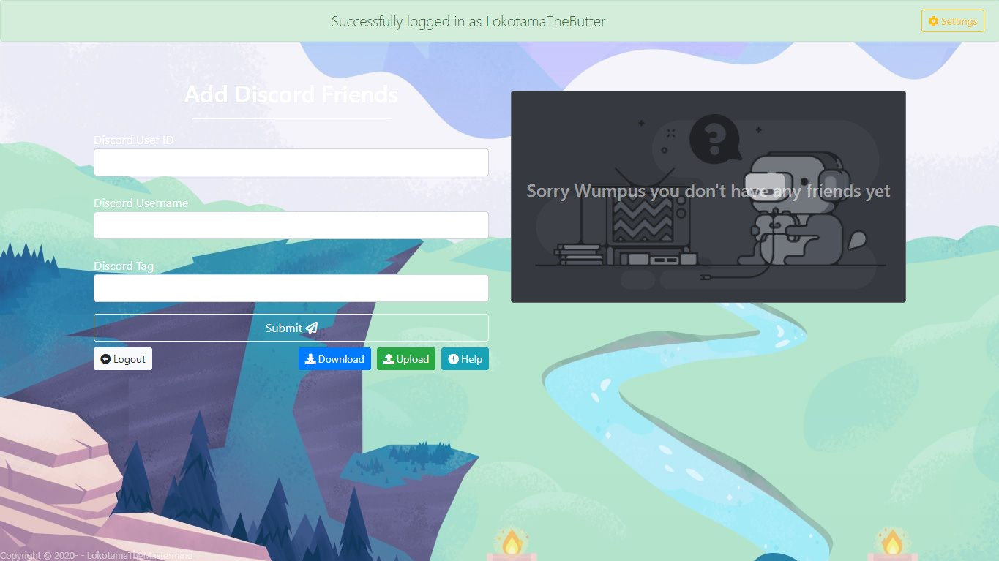

<div></div>

**PS: this repository is no longer being maintained, it's suggested to migrate to <https://github.com/OyewoleOyedeji/prodis> instead**

# Discord Friends


## Description

Backup discord friends incase of account loss

## Requirements

They are listed in the `environment.yml` and `requirements.txt` file in the root folder

### External tools

1. mkcert

## Installation

## Anaconda Environment

1. Clone this repository with command `git clone https://github.com/themasterminds-tech/discord-friends.git`
2. Install the dependencies in the `environment.yml` file
3. Run the command `python manage.py runserver:{PORT}` where `{PORT}` is the port where the server runs on. This will start the non-ssl server!
4. Enjoy backing up your friends from discord!

## PIP

1. Clone this repository with command `git clone https://github.com/LokotamaTheMastermind/discord-friends.git`
2. Install the dependencies in the `requirements.txt` file
3. Run the command `python manage.py runserver:{PORT}` where `{PORT}` is the port where the server runs on. This will start the non-ssl server!
4. Enjoy backing up your friends from discord!

### SSL enabled server

Instead of running `python manage.py runserver:{PORT}` command. Run this command `python manage.py runsslserver --cert discordfriends.development.pem --key discordfriends.development.pem {PORT}`

### Accessing from other machines

1. Edit the `discord_friends/settings.py` to reflect the following changes

    ```python
    ALLOWED_HOSTS = [
        'localhost'
        '127.0.0.1'
        'your_ip_address'
    ]
    ```

    Replace `your_ip_address` with the IP address of host computer on your current network.
2. After this change is done run the following command `python manage.py runserver 0.0.0.0:{PORT}`
3. Try accessing `{HOST_IP_ADDRESS}:{PORT}` on the other device if everything is done currently then the page will load up

**Note:** this can be combined with the `python manage.py runsslserver` command to run secure connections of the server to other devices. To combine it run the following command `python manage.py runsslserver --key discordfriends.development.pem --cert discordfriends.development.pem 0.0.0.0:{PORT}` where the port is the where the server will run

### Tip

If you set up the project properly you'll get the following pages

- when your logged in



- and when you logout or start new session


## FAQ

1. > How do you find the `User ID` of a discord user

    > Enable the `Developer` options of your Discord account. After that right click on users account and look for the option `Copy User ID`

2. > Why can't I change the `User ID` once created

   > The `User ID` provided by Discord are immutable thereby making you not able to change them
